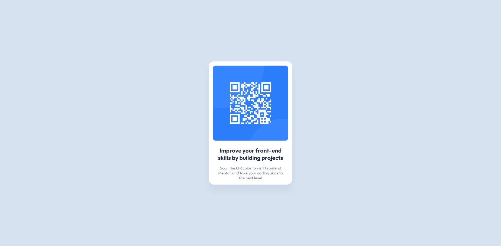

# Frontend Mentor - QR code component solution

This is a solution to the [QR code component challenge on Frontend Mentor](https://www.frontendmentor.io/challenges/qr-code-component-iux_sIO_H). Frontend Mentor challenges help you improve your coding skills by building realistic projects.

## Table of contents

- [Overview](#overview)
  - [Screenshot](#screenshot)
  - [Links](#links)
- [My process](#my-process)
  - [Built with](#built-with)
  - [What I learned](#what-i-learned)
  - [Continued development](#continued-development)
  - [Useful resources](#useful-resources)
- [Author](#author)

## Overview

### Screenshot

### Links

- [Solution URL](https://github.com/NikaDalalishvili/qr-code-component)
- [Live Site URL](https://nikadalalishvili.github.io/qr-code-component/)

## My process

### Built with

- Semantic HTML5 markup
- CSS custom properties
- Flexbox
- Mobile-first workflow
- scss - [Sassy Cascading Style Sheets](https://sass-lang.com/documentation/at-rules/control/for/)

### What I learned

Actually, nothing special, It was pretty easy for me.

### Continued development

First I want to finish the javascript course I'm taking on freecodecamp, I'm also going through the learning path on Frontendmentor, and after that I want to focus more on React, Next.js and Node.js.

### Useful resources

- [ChatGPT](https://chatgpt.com/) - He is my hero, if I need something fast, if I can't understand something, or if I can't find it on the internet, I always ask him.
- [W3Schools](https://www.w3schools.com/) - This is my favorite documentation platform I've been using since I started programming, it's the best explained resource.
- [YouTube](https://www.youtube.com/) - I'm always looking for news and listening to other developers, sharing their experiences so that I can see many different solutions to a problem.

## Author

- Frontend Mentor - [@NikaDalalishvili](https://www.frontendmentor.io/profile/NikaDalalishvili)
- Instagram - [@nika.dala](https://www.instagram.com/nika.dala/)
- YouTube - [@nikadala](https://www.youtube.com/@nikadala)
- TikTok - [@nika.dala](https://www.tiktok.com/@nika.dala)
